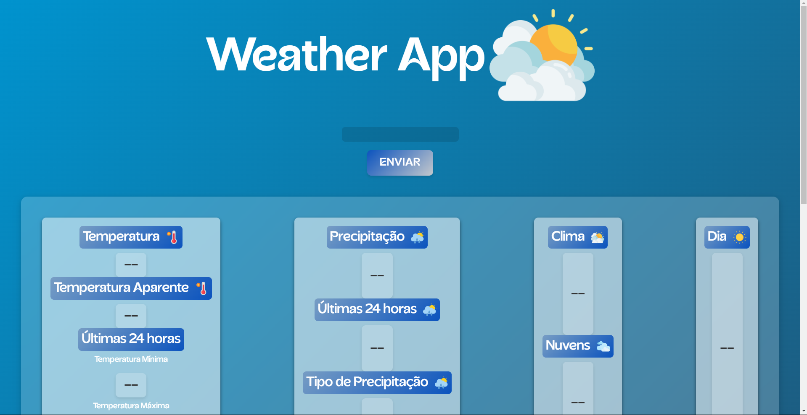

# Weather App 🌤️

https://github.com/caiosss/weather-app/assets/138716168/f699c0c3-c5ed-41c2-8f37-ea153928dd73

## 💭 O que é esse projeto?
Esse projeto é uma página feita com HTML, CSS e Javascript que contém um input para inserir o nome de uma cidade e um botão de enviar o nome para que haja a devida localização com o retorno de dados meteriológicos.

## 💻 Como rodar esse projeto? 
Para rodar o projeto basta dar dois cliques no *index.html* uma vez que a pasta do projeto esteja aberta no sistema de arquivos do seu sistema operacional.

Alternativamente, você também pode usar a extensão *Live Server* do *VSCode* para rodar o projeto.

## 🕹️ Como usar este projeto?
Uma vez que a aplicação esteja rodando, você pode clicar no input e inserir uma cidade com a sigla do Estado para facilitar a busca, pois existem inúmeras cidades com o mesmo nome em diversos países.

## ⚙️ Tecnologias usadas no projeto
 
 
 

 ## 📒 Features do Projeto
 - Input para por o nome da cidade
 - Botão para enviar os dados
 - Cards com os dados meteriológicos disponibilizados pela API Accuweather.

 ## 👨‍💻 Como este projeto foi implementado?
 Este projeto foi implementado usando HTML, CSS e Javascript.

 No Javascript o valor do input é passado quando um evento de click é disparado pelo botão.

 Ao clicar no botão, irá acontecer a busca e chamada da API pelo valor passado no input. Caso o valor não seja encontrado ou a requisição demore a acontecer irá aparecer um **alert** avisando que houve um erro.

 Cada card de informação climática está ligado a uma propriedade do objeto retornado pela função assíncrona que pega as condições atuais do local de acordo com a chave de localização disponibilizada pela API.

 ## Contriubuidores
 - [Caio](github.com/caiosss) - mantedor do projeto.

## 🆘 Precisa de ajuda?
Você pode entrar em contato comigo em **caiobarros1712@gmail.com**. 

 ---
 
Feito com ☕ por Caio

